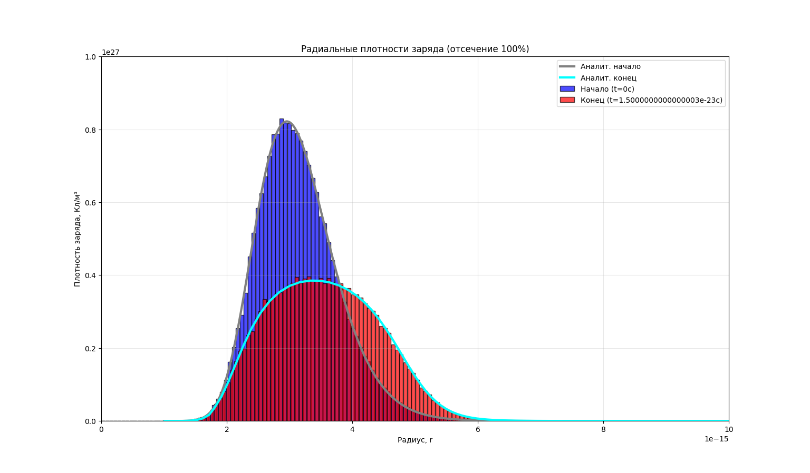
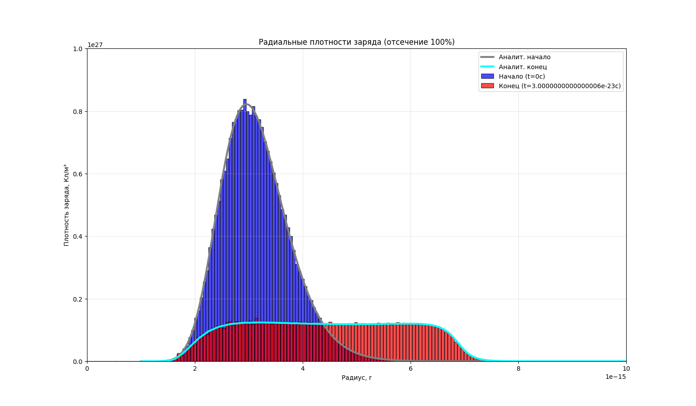
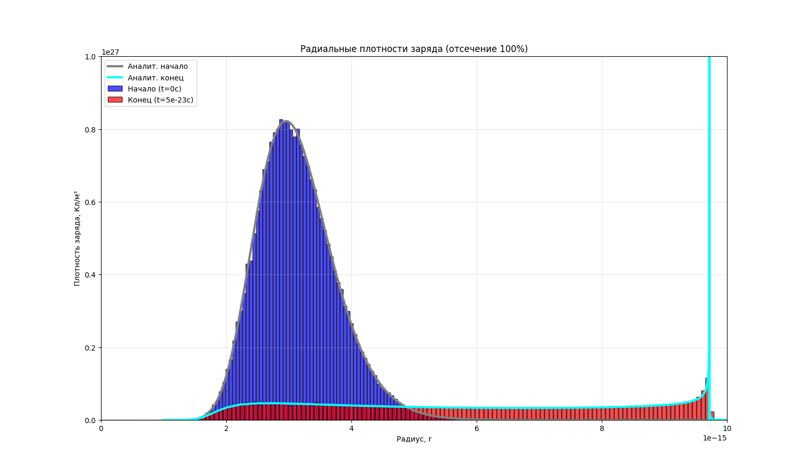

# Численное моделирование плазмы

## 🎯 Суть проекта
Данный проект реализует идеологию particle-to-particle численного моделирования поведения системы N-тел. 
В этом случае считается для каждой частицы сумма действующих на нее сил со стороны всех остальных частиц, что подразумевает $O(n^2)$ сложность алгоритма. 

Для ускорения расчетов используется библиотека numba, позволяющая в какой-то степени распараллелить расчет сил и добавить скорости вычислений 
за счет jit (just in time компиляции).

Проект был написан для проверки теоретических результатов, связанных с эволюцией динамики релятивистской плазмы.

## 📦 Установка (через pip)

Копирование проекта:
```commandline
git clone https://github.com/ivanbaibara/relativism
cd relativism
```

Создание venv:
```commandline
python3 -m venv .venv
source .venv/bin/activate
```

Установка зависимостей:
```commandline
pip install --upgrade pip
pip install -r requirements.txt
```

## 🚀 Запуск примера

Для начала требуется сгенерировать данные. Этот пример моделирует эволюцию системы, определенного вида (сферическая симметрия, лог-нормальное 
распределение) для сравнения с теоретическим результатом (требуется запускать из корня проекта):
```commandline
python -m examples/simple_generate.py
```

Далее можно посмотреть эволюцию характеристик данной системы, в конкретном случае будут построены график динамики отдельных сферических слоев со 
временем.

Для этого необходимо указать сгенерированный файл в файле characteristics_analysis.py в строке:
```python
filename = f'{root_dir}/solved/ваш файл .npz'
```

После этого можно запустить пример:
```commandline
python -m examples/characteristic_analysis.py
```

## 🌌 Полученная динамика системы



